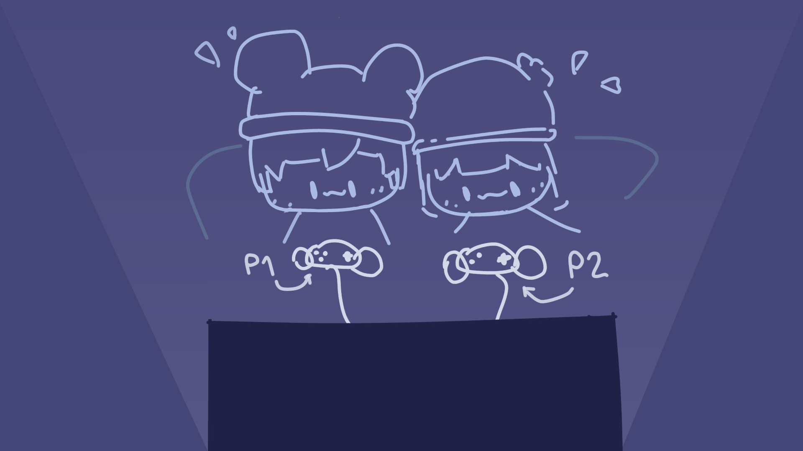

# One Screen Mode




This mode allows for local multiplayer games. Players can connect multiple controllers to play on a single screen.

## Input Behaviour
In this mode, the input system will return a new input action with the device id assigned to it.


## Starting the one-screen mode.

```gd
mpc.start_one_screen()
```


**Before starting this mode!**
How many players will be created depends on the maximum number of players you specify! If you need to specify your player count, set the `mpc.max_players` variable first!
