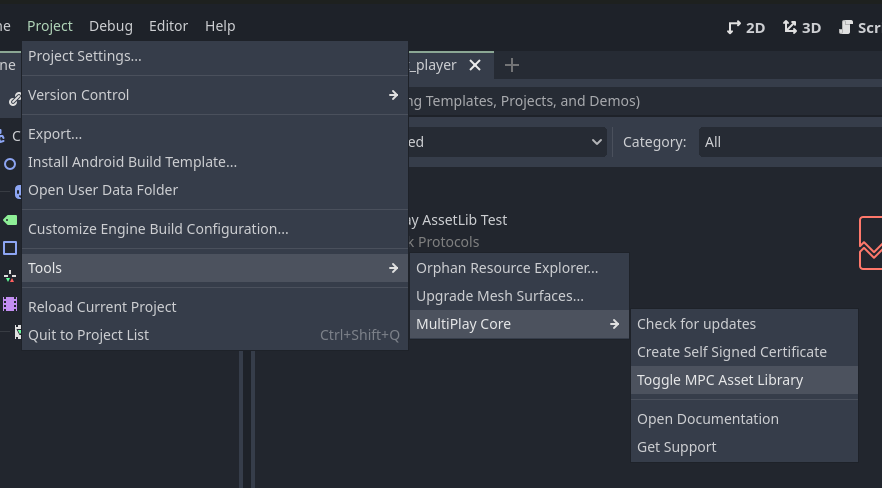
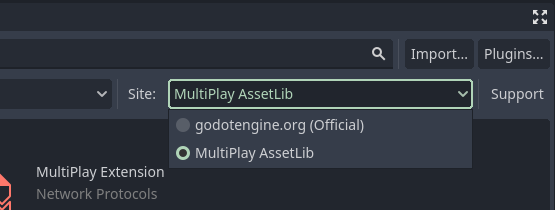

# Using MultiPlay Asset Library

MultiPlay Core has its own Asset Library (https://assets.mpc.himaji.xyz/) dedicated to extending MultiPlay Core functionalities.

## How to enable it

1. Go to Project -> Tools -> MultiPlay Core -> Toggle MPC AssetLib

2. Change AssetLib's Site to MultiPlay AssetLib


If you don't see MultiPlay AssetLib being listed here. The workaround is to open and close the Editor Settings menu (Editor -> Editor Settings...)


And now you can use the asset library like you would do in the normal asset library!

## How can I publish my components?
Right now components are manually approved. You can submit one by creating a pull request in [this repository](https://github.com/maji-git/multiplay-assetlib). Note that your extension repository must use the [MultiPlay Extension template repository](https://github.com/maji-git/multiplay-extension-template), to make sure it works properly in production.