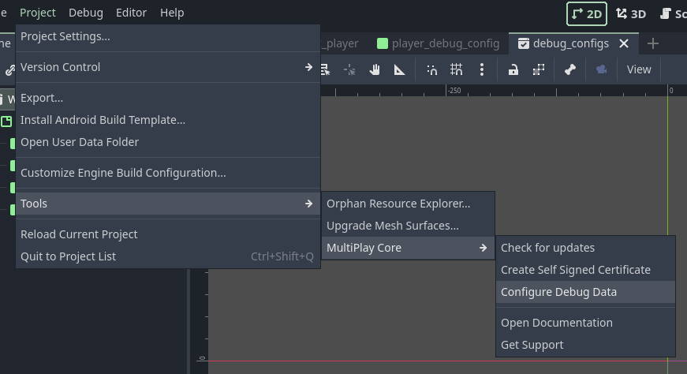
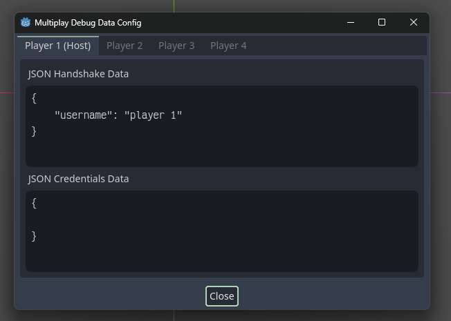

# Debugging Configurations

This page will highlight some of the useful configurations for MultiPlay Debugger.

## Configure join data before running the debug
You may want to pass handshake/credentials data on debug plays. These data can be configured in Project -> Tools -> MultiPlay Core -> Configure Debug Data

You can then configure the join data here

