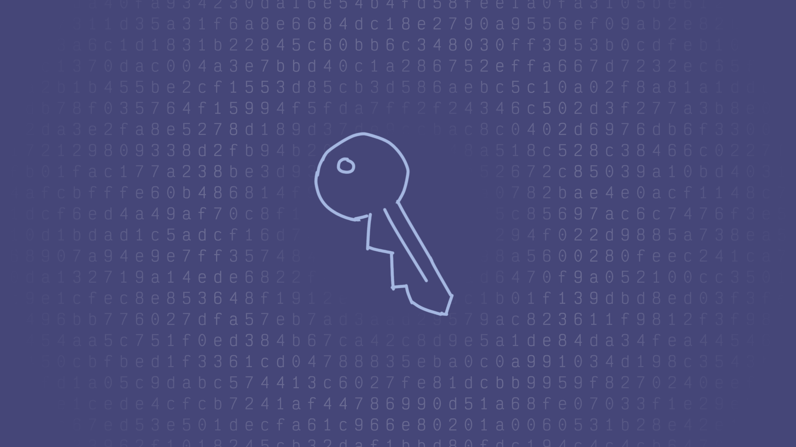
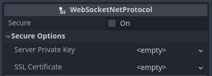
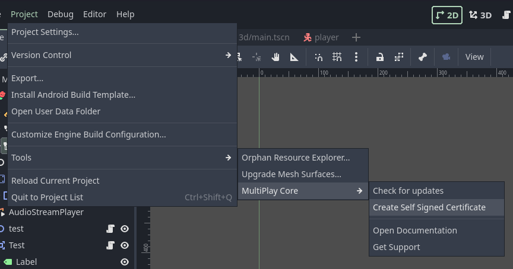

# Using Encryption

Some Network Protocol comes with Encryption out of the box. If secure options are available, you can enable the `secure` option, and then specify your certificates.

### Creating self-signed certificates

MultiPlay Tools also comes with a self-signed certificate generator. Certificates generated from it should only be used for debugging purposes.

You can locate the menu at Project -> Tools -> MultiPlay Core -> Create Self-Signed Certificate

Both private key and certificate files will be created at `res://private_key.key` and `res://cert.crt`. If you don't see these files, you might need to refocus the editor window.


Self-signed certificate tool will create certificate for `127.0.0.1`



You should always ignore .key files in client export to prevent private key exposure.

