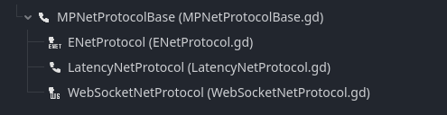

# Network Protocols

MultiPlay Core comes with a flexible  Network Protocol options. You can choose which network implementation you like!

## Adding Network Protocol

You can add a network protocol to  MultiPlay Core by searching up "NetProtocol" in add node menu.

## Built-in Network Protocols

Network Protocols that comes with MultiPlay Core.

- [ENet](/docs/manual/net-protocols/enet) A relatively thin, simple and robust network communication layer on top of UDP.
- [WebSockets](/docs/manual/net-protocols/websocket) WebSockets implementation for developers targetting towards HTML5 exports.
- [Latency](/docs/manual/net-protocols/latency) Network Protocol that simulates bad internet connection.


Got your own implementation? Feel free to contribute to the list! You can reach out to me if you had your own implementation. Info about protocol creation can be found at [Custom Protocols](custom).

