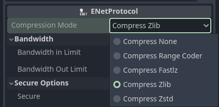

# ENet Protocol

ENet Protocol is a network protocol that uses Godot's [`ENetMultiplayerPeer`](https://docs.godotengine.org/en/stable/classes/class_enetmultiplayerpeer.html)

> *ENet's purpose is to provide a relatively thin, simple and robust network communication layer on top of UDP*

## Compression
ENet Protocol comes with compression options out of the box. For more information about choosing the compression that's right for you, check out [this article](https://morrismorrison.blog/decoding-data-efficiency-a-comprehensive-guide-to-compression-types-in-godot-multiplayer-networking) for more info.

## Secure Connections

ENet Network Protocol comes with secure options out of the box. You can read more guides at [Encryption](/docs/manual/encryption).