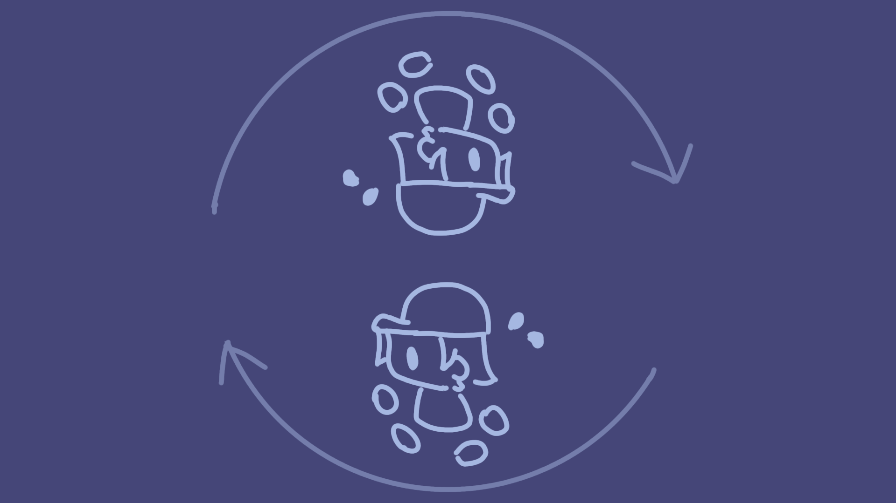

# Keeping players in sync

There are multiple ways to synchronize state to all players across the network.

## Using Godot's native Multiplayer Features

Godot comes with its own high-level multiplayer, and since that's what MultiPlay was built on top of. You're free to use bulit-in API/Node. Which includes

### MultiplayerSynchronizer

MultiplayerSynchronizer can be used to synchronize properties from the multiplayer authority to all players in the network.

More info [here](https://docs.godotengine.org/en/stable/classes/class_multiplayersynchronizer.html).

### MultiplayerSpawner

MultiplayerSpawner can be used to automatically replicate scene from the multiplayer authority to all players in the network.

More info [here](https://docs.godotengine.org/en/stable/classes/class_multiplayerspawner.html).

### Remote procedure calls

`rpc` and `rpc_id` are the most common functions in Godot multiplayer. It allows functions to be called by other players.

More info [here](https://docs.godotengine.org/en/stable/tutorials/networking/high_level_multiplayer.html#remote-procedure-calls).

## Using MultiPlay's Synchronizers

MultiPlay Core also comes with its own synchronizers for specific uses, you can read about it more in the [synchronizers category](/docs/manual/synchronizers/anim-sync).