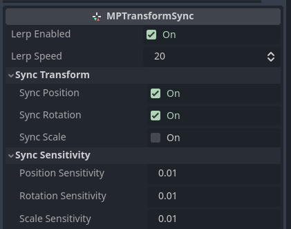

# Transform Synchronizer

Transform Synchronizer sync node's transform from multiplayer authority to all players in the network.

Simply add  `MPTransformSync` to the node you want the transform to sync.

## Setting transform from the server

The server can also set the transform of the node directly, even without direct authority. You can call  `MPTransformSync`'s respective function depending on what you want to change, functions include:

- `set_position_2d(to: Vector2)`
- `set_rotation_2d(to: float)`
- `set_scale_2d(to: Vector2)`
- `set_position_3d(to: Vector3)`
- `set_rotation_3d(to: Vector3)`
- `set_scale_3d(to: Vector3)`